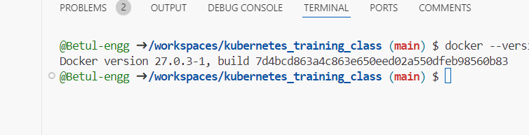
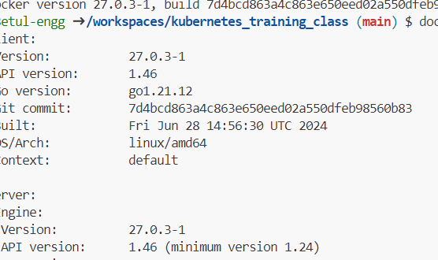

# Docker version check

```bash
docker --version
```



```bash
docker version
```



Elbette! Docker sürümünü kontrol etmek için terminalde aşağıdaki komutu kullanabilirsin:

```bash
docker --version
```

Bu komut, yüklü olan Docker sürümünü gösterecektir. Eğer Docker'ın daha fazla bilgisine ihtiyaç duyarsan, şu komutu kullanabilirsin:

```bash
docker version
```

Bu komut, hem istemci hem de sunucu sürümlerinin detaylarını verecektir. Eğer başka bir konuda yardım istersen, sormaktan çekinme!
